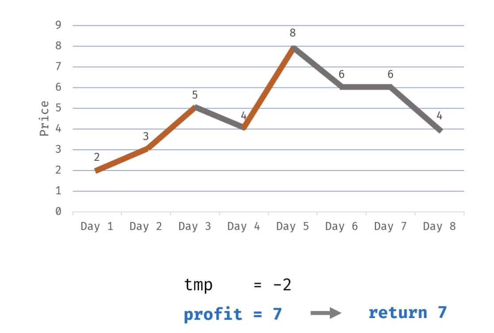

# 122. Best Time to Buy and Sell Stock II

## 暴力法

```python
class Solution:
    def maxProfit(self, prices: List[int]) -> int:
        f = [0] * len(prices)
        k = 0
        for i in range(1, len(prices)):
            f[i] = f[i-1]
            for j in range(0, i):
                if prices[i] > prices[j]:
                    f[i] = max(f[i], f[j] + (prices[i] - prices[j]))
        return f[-1]
```


## 贪心法

这是一个**很符合直觉**，但是证明比较难的方法。

我们是怎么买股票实现最大利润？显然就是 **低入高抛**。

可以尝试证明: 
- 累计长度为1天的区间利润和 (即多个 `prices[i] - prices[i-1]`) 
- 比长度更大的区间利润和更好(即 `prices[i] - prices[j]`)
- 因为不需要考虑下跌？
- （暂时还看不懂官解）



```python
class Solution:
    def maxProfit(self, prices: List[int]) -> int:
        ans = 0
        n = len(prices)
        for i in range(1, n):
            ans += max(0, prices[i] - prices[i-1])
        return ans
```

## 动态规划

有点像“不等式方程组”，在约束下找到最优解。

- 状态:
  - (1) `f[i][0]` 第i天没有持有股票的利润
  - (2) `f[i][1]` 第i天持有股票的利润
- 状态转移的约束
  - (1) `f[i][0] = max(f[i-1][0], f[i-1][1] + prices[i])`
    - 把股票卖了，或者没有股票
  - (2) `f[i][1] = max(f[i-1][1], f[i-1][0] - prices[i])`
    - 本来就有股票，或者买入股票


```python
class Solution:
    def maxProfit(self, prices: List[int]) -> int:
        n = len(prices)
        f = []
        for _ in range(n):
            f.append([0] * 2)

        f[0][0] = 0
        f[0][1] = -prices[0]
        for i in range(1, n):
            f[i][0] = max(f[i-1][0], f[i-1][1] + prices[i])
            f[i][1] = max(f[i-1][1], f[i-1][0] - prices[i])
        return max(f[n-1][0], f[n-1][1])
```


